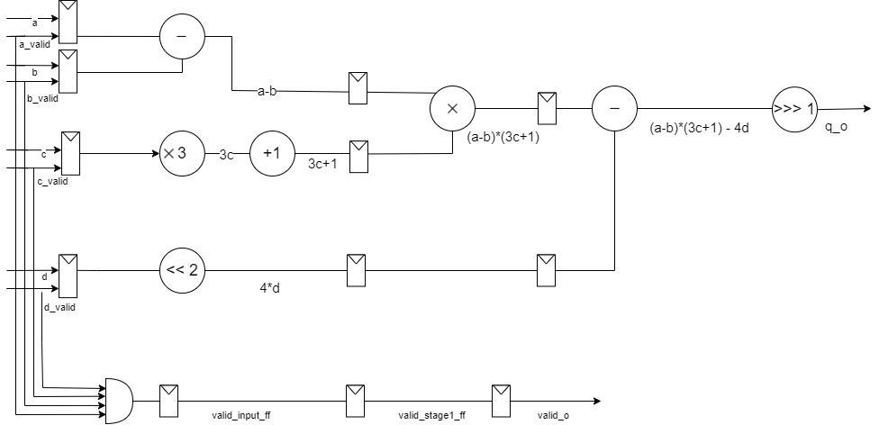
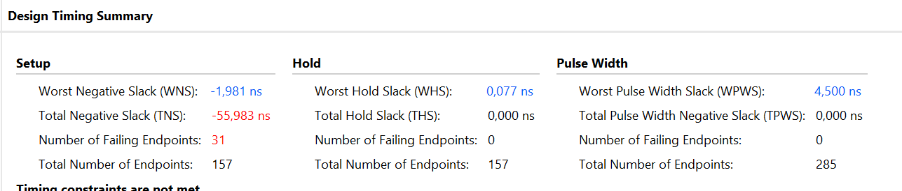

# Тестовое задание к Импульсу

## Содержание

1. [Структура репозитория](#структура-репозитория)
2. [Структурная схема]( #структурная-схема-блока )
3. [Описание работы устройства]( #описание-работы-устройства )
4. [Описание работы тестового окружения](#описание-работы-тестового-окружения)
5. [Исправление ошибок разрядной сетки](#исправление-ошибок-разрядной-сетки)
6. [Использованные допущения](#использованные-допущения)
7. [Оценка итогового дизайна](#оценка-итогового-дизайна)

## Структура репозитория

Данный репозиторий представляет собой выполненное тестовое задание для стажировки импульс. В репозитории содержится несколько разделов:

1) Директория `img` содержит структурную схему устройства
2) Директория `rpts` содержит отчёт по утилизации сгенерированный САПР Vivado
3) Директория `rtl` содержит файлы исходного кода модуля
4) Директория `sim` содержит файлы используемые для симуляции работы устройства, а также директорию `tb` содержащий тестовые окружения.

## Структурная схема блока

## Описание работы устройства

Данный блок представляет из себя 3-стадийный вычислительный конвейер. На 1 стадии параллельно вычисляются 3 операции из числителя данного выражения: `A - B`, `1 + 3*C`, `4*D`. При этом, для оптимизации умножение на 4, как степень двойки производится сдвигов влево на 2 бита, а прибавление 1 специальным модулем инкрементором позволяя не задействовать полноценный сумматор. На следующей стадии вычисляется произведение первых двух выражений, в результате чего получается следующее: `(A - B) * (1 + 3*C)`. На следующей стадии формируется итоговое значение выражение. Вычитается `4*D`, а также происходит деление на 2. Для оптимизации также используется блок сдвига, на этот раз арифмитического сдвига вправо на 1 бит.

Устройство также использует сигналы valid для корректного считывания данных со входов. Входные регистры устройства имеют сигнал разрешения подключенный к входным сигналам valid всех 4 входных параметров. Кроме того, так как схема выдает результат вычисления через 3 такта, то для указания корректности данных на выходе используется сигнал valid_o который формируется как логическое И всех входных сигналов valid.

Арифметические блоки, за исключением инкрементора реализуются через простые арифмитические выражения для более эффективной оптимизации самим синтезатором, за исключением проверки переполнения. В случае переполнения разрядной сетки на выход вычислителя выставляется либо максимально возможное число данной разрядности, либо минимальное.

## Описание работы тестового окружения

В данном репозитории представлено 2 варианта тестового окружения `top_tb` и `top_python_tb`. 

Первый вариант полностью самостоятелен и генерирует случайные входные значения, которые добавляет в очередь, после чего, когда на выходе valid_o появляется 1 эти входные данные достаются из очереди и вычисляется проверочное значение для сравнения с реальным значением из модуля. В случае не совпадения этих данных выводится ошибка с указанием ожидаемого и реального значений, а также времени ее возникновения.

Второй вариант во моногом схож с первым, за исключением того, что входные воздействия генерируются python-овским скриптом в mem-файл, из которого потом считываются в тестовом окружении. А также при проверке выходного значения модуля это значение и значение рассчитанное в тестбенче записываются в отдельный txt файл для последующей проверке в python-овском файле. В остальном принцип работы одинаков.

## Исправление ошибок разрядной сетки

В данном дизайне в каждом вычислительном блоке проводится проверка на переполнение, в случае обнаружение такового на выход подается либо максимально возможное в данной разрядной сетке число, либо минимально возможное, в зависимости от характера переполнения.

Как самый очевидный вариант возможно повышение разрядности данных после вычислительных блоков, что однако сильно увеличит затраты аппаратных ресурсов.

## Использованные допущения

Пункт d задания "набор параметров a,b,c,d должен подаваться на вход схемы синхронно" - принято как все входные данные подаются на вход схемы в течение 1 такта, для синхронности добавлены входные триггеры.

Пункт е задания "разрядность данных должна определяться параметром" - принято как разрядность всех параметров, а также результата Q определяется одним общим параметром.

## Оценка итогового дизайна

Для синтеза и имплементации был использован САПР Vivado 2024.1. Синтез проводился для 32 разрядных данных. Использованная плата xc7a100tcsg324-1. В качестве тактовой частоты используется 100 МГц.

### Оценка затраченных аппаратных ресурсов

Согласно отчету по утилизации сгенерированному Vivado на реализацию данного модуля затрачено 439 LUT, 284 Регистров, а также 4 DSP ячейки. Все LUT используются для синтеза логики, а не ячеек памяти, что является оптимальным для такого небольшого модуля. Затрачено порядка 0.69% от общего числа LUT. Затраченные регистры составляют порядка 0.22% от общего числа Slice регистров, т.е уже существующих, а не синтезируемых с помощью LUT. Затрата DSP ячеек составила 4 штуки, при этом все они используются в последнем умножителе модуля. Использование большего числа DSP ячеек могло бы уменьшить затраты LUT и CARRY4 примитивов, однако ухудшило бы временные характеристики схемы.

Отчет по утилизации сгенерированный САПР можно увидеть по пути `rpts/utilization_report.txt`

### Оценка тактовой частоты 

Согласно временному отчету Worst Negative Slack составил -2.339 нс. По определению - это разница между периодом тактового сигнала и суммой времени прохождения сигнала от выхода одного триггера до входа следующего, а также времени установки триггера. Исходя из этого можно рассчитать рабочую частоту для текущего варианта дизайна:
$f = \frac{1}{10 - (-1.981)} = 83.5 $ МГц. 

Уменьшая или увеличивая разрядность данных можно добиться большей частоты или меньшей соотвественно засчёт уменьшения затрат аппаратных ресурсов на умножители.

При этом, критический путь лежит на умножителе перемножающем `A-B` и `1+ 3*C`. Так как данный участок модуля не содержит иной комбинационной логики средством оптимизации данного критического пути может служить лишь написание собственного умножителя и разбиение его регистрами на несколько тактов вычисления для уменьшения критического пути. Однако, в таком случае, нужно рассчитывать производительность схемы с учетом увеличевшейся латентности, так как неизвестно насколько это будет целесообразно.